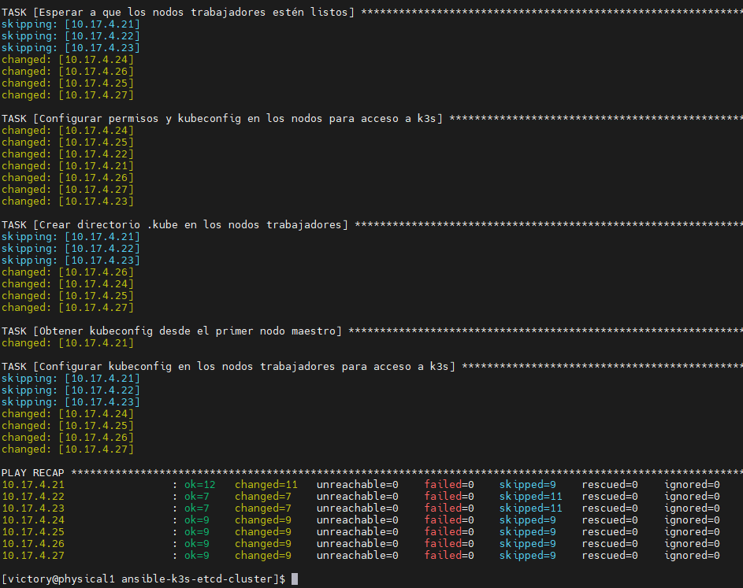
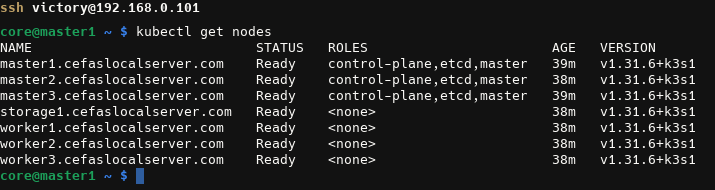

# Ansible K3s ETCD Cluster

Este proyecto, **ansible-k3s-etcd-cluster**, proporciona playbooks de Ansible y configuraciones para desplegar un clúster de Kubernetes (K3s) de alta disponibilidad con etcd embebido en múltiples nodos. Usando este repositorio, puedes configurar nodos maestros y trabajadores, automatizar las configuraciones de los nodos y simplificar la gestión de tu clúster K3s.

## Características
- **Despliegue automatizado de K3s**: Rápidamente despliega K3s en múltiples nodos.
- **ETCD embebido**: Proporciona un almacén de datos resiliente para alta disponibilidad.
- **Configuración de nodos basada en roles**: Asigna fácilmente nodos como maestros o trabajadores.
- **Creación de servicio Systemd**: Asegura que K3s se ejecute al arrancar y sea gestionado por systemd.
- **Compatibilidad con Flatcar Linux**: Compatible con Flatcar Container Linux y sistemas operativos inmutables similares.
- **Acceso seguro con claves SSH**: Asegura el acceso a los nodos y las conexiones mediante claves SSH.

## Resumen del Clúster

La configuración soporta una estructura multi-maestro, multi-trabajador con balanceo de carga opcional y nodos de infraestructura adicionales (Redis, PostgreSQL, etc.). A continuación se muestra un ejemplo de diseño de red que este repositorio puede ayudar a configurar:

- **IP Pública (HTTPS)** → **Nodo Bastion (Acceso SSH)** → **Balanceador de Carga (Traefik)** → **Nodos Maestros + Nodos Trabajadores + Nodos de Infraestructura**

## Estructura del Inventario

El archivo de inventario `inventory.ini` permite configurar:
- **Nodos Maestros**: Alojan el almacén de datos etcd y controlan el clúster.
- **Nodos Trabajadores**: Ejecutan aplicaciones y cargas de trabajo.
- **Balanceador de Carga**: (Opcional) Balancea el tráfico al clúster.
- **Base de Datos y Cache**: Nodos de infraestructura adicionales según sea necesario.

Ejemplo de `inventory.ini`:
```ini
[bootstrap]
10.17.4.21 ansible_user=core ansible_ssh_private_key_file=/path/to/key ansible_port=22
# Agregar más nodos aquí...

[masters]
10.17.4.21 ansible_user=core ansible_ssh_private_key_file=/root/.ssh/cluster_openshift/key_cluster_openshift/id_rsa_key_cluster_openshift ansible_port=22
10.17.4.22 ansible_user=core ansible_ssh_private_key_file=/root/.ssh/cluster_openshift/key_cluster_openshift/id_rsa_key_cluster_openshift ansible_port=22
10.17.4.23 ansible_user=core ansible_ssh_private_key_file=/root/.ssh/cluster_openshift/key_cluster_openshift/id_rsa_key_cluster_openshift ansible_port=22

[workers]
10.17.4.24 ansible_user=core ansible_ssh_private_key_file=/root/.ssh/cluster_openshift/key_cluster_openshift/id_rsa_key_cluster_openshift ansible_port=22
10.17.4.25 ansible_user=core ansible_ssh_private_key_file=/root/.ssh/cluster_openshift/key_cluster_openshift/id_rsa_key_cluster_openshift ansible_port=22
10.17.4.26 ansible_user=core ansible_ssh_private_key_file=/root/.ssh/cluster_openshift/key_cluster_openshift/id_rsa_key_cluster_openshift ansible_port=22
```

## Requisitos Previos
- **Ansible** instalado en la máquina de control.
- Acceso **SSH** a todos los nodos con claves configuradas según el inventario.
- Acceso a **Internet** para descargar los binarios de K3s en cada nodo.

## Uso

1. Clona el repositorio:
   
   ```bash
   git clone https://github.com/yourusername/ansible-k3s-etcd-cluster.git
   cd ansible-k3s-etcd-cluster
   ```
2. Actualiza el Inventario: Edita `inventory.ini` con las direcciones IP y detalles de acceso para tus nodos.
   
3. Ejecuta el Playbook: Despliega K3s y configura el clúster con:
   
   ```bash
   sudo ansible-playbook -i inventory.ini install_k3s.yaml
   ```

## Estructura del Playbook
El playbook principal, `install_k3s.yaml`, incluye tareas para:
- Instalar K3s en todos los nodos.
- Crear servicios systemd para gestionar K3s en nodos maestros y trabajadores.
- Unir nodos trabajadores y nodos maestros adicionales al clúster.

## Personalización de Plantillas
Las plantillas de servicio para systemd están ubicadas en el directorio `templates`. Puedes personalizar:
- `k3s_master.service.j2` para la configuración del maestro principal.
- `k3s_master_join.service.j2` para unir maestros adicionales.
- `k3s_agent.service.j2` para los nodos trabajadores.

## Verificación del Clúster
Para verificar el estado del clúster:
```bash
kubectl get nodes
```
Asegúrate de que cada nodo esté en estado **Ready**.

## Solución de Problemas
- **Problemas de conexión con nodos**: Verifica el acceso SSH para cada nodo como está configurado en `inventory.ini`.
- **Problemas de permisos con `kubectl`**: Asegúrate de que los permisos de kubeconfig estén configurados correctamente.

Para cualquier otro problema, por favor crea un issue en GitHub.

## Contribuciones
¡Las contribuciones son bienvenidas! Por favor, envía un pull request o abre un issue si encuentras errores o tienes sugerencias de mejora.

## Licencia
Este proyecto está licenciado bajo la **Licencia MIT**.

## Contacto
Para cualquier duda o problema, por favor abre un issue en el repositorio o contacta al mantenedor del proyecto.


# ansible-k3s-etcd-cluster

Ansible project to deploy a Kubernetes (K3s) cluster with etcd as the datastore, designed for Flatcar Container Linux nodes. This playbook automates the installation and configuration of a resilient K3s cluster with a dedicated control plane and worker nodes.

## Project Structure

```plaintext
.
├── install_k3s.yaml                # Main Ansible playbook
├── inventory.ini                   # Inventory of nodes
├── README.md                       # Project documentation
└── templates                       # Systemd service templates
    ├── k3s_agent.service.j2        # Template for worker nodes
    ├── k3s_master_join.service.j2  # Template for additional master nodes
    └── k3s_master.service.j2       # Template for the first master node
```


**Mantenedor del Proyecto:** [Victor Galvez](https://github.com/vhgalvez)


```bash
sudo cat /var/lib/rancher/k3s/server/node-token
K105285ff598aec61abdf70c75ece64e56782d395222d6d8eabc9c49cadd74dcb8f::server:04fd44c81582d038e72d28d2ef7114b7
```


## master

```bash
sudo tee /etc/systemd/system/k3s.service > /dev/null <<EOF
[Unit]
Description=Lightweight Kubernetes
Documentation=https://k3s.io
Wants=network-online.target
After=network-online.target

[Service]
Type=exec
ExecStart=/opt/bin/k3s server --server https://10.17.4.21:6443 --token K105285ff598aec61abdf70c75ece64e56782d395222d6d8eabc9c49cadd74dcb8f::server:04fd44c81582d038e72d28d2ef7114b7
Restart=on-failure
KillMode=process
Delegate=yes
LimitNOFILE=1048576
LimitNPROC=1048576
LimitCORE=infinity

[Install]
WantedBy=multi-user.target
EOF
```


# worker 

```bash
sudo tee /etc/systemd/system/k3s-agent.service > /dev/null <<EOF
[Unit]
Description=Lightweight Kubernetes Node
Documentation=https://k3s.io
After=network-online.target

[Service]
Type=exec
ExecStart=/opt/bin/k3s agent --server https://10.17.4.21:6443 --token K105285ff598aec61abdf70c75ece64e56782d395222d6d8eabc9c49cadd74dcb8f::server:04fd44c81582d038e72d28d2ef7114b7
Restart=always
LimitNOFILE=1048576
LimitNPROC=1048576
LimitCORE=infinity

[Install]
WantedBy=multi-user.target
EOF
```

## Paso 4: Instalar K3s en los Nodos Trabajadores

```bash
sudo systemctl daemon-reload
sudo systemctl enable k3s
sudo systemctl start k3s
```

## Cluster k3s




## Cluster k3s con etcd 



